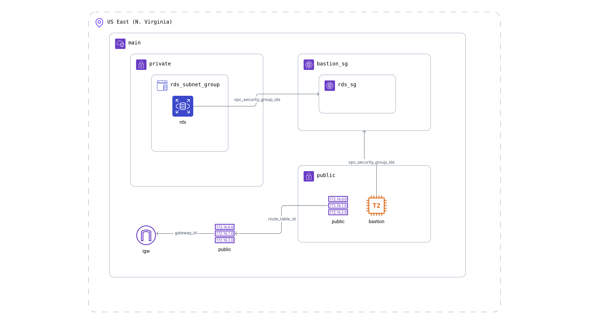

# Secure RDS Deployment with Terraform

## Overview

This project deploys a secure Amazon RDS (PostgreSQL) instance using Terraform with a Bastion host for secure access, following AWS best practices. The infrastructure includes a VPC with public and private subnets, security groups, and proper network isolation.

## Architecture



*Figure: AWS RDS Infrastructure with Bastion Host Architecture*

### Components

- **VPC**: Custom VPC with DNS support and hostnames
- **Public Subnet**: Hosts the Bastion instance with internet access
- **Private Subnets**: Host the RDS instance (multi-AZ for high availability)
- **Bastion Host**: EC2 instance for secure SSH access to private resources
- **RDS Instance**: PostgreSQL database in private subnet
- **Security Groups**: Restrictive access controls
- **NAT Gateway**: Provides internet access for private subnet resources

## Security Practices

### Network Security
- **Private RDS**: Database is not publicly accessible
- **Bastion Host**: Only entry point to private resources
- **Security Groups**: 
  - Bastion: SSH (port 22) access only from specified IP
  - RDS: PostgreSQL (port 5432) access only from Bastion security group
- **Network Isolation**: Clear separation between public and private subnets

### Access Control
- **IP Restriction**: SSH access limited to your specific IP address
- **Key-based Authentication**: EC2 instance uses SSH key pairs
- **Database Access**: Only accessible through Bastion host tunnel

### Data Protection
- **Encryption**: Terraform state stored encrypted in S3
- **No Hardcoded Secrets**: Sensitive values managed through variables
- **Skip Snapshot**: Configured for development (adjust for production)


Complete Traffic Flow in the Project
1. Overview of Components

Here’s what our network contains:

Component         	                                Purpose

VPC (10.0.0.0/16)                 -	Private network container for all resources
Public Subnet (10.0.1.0/24) 	    - Hosts Bastion host & NAT Gateway; has Internet Gateway route
Private Subnet A (10.0.2.0/24)	  - Hosts RDS DB (multi-AZ setup, part A)
Private Subnet B (10.0.3.0/24)	  - Hosts RDS DB (multi-AZ setup, part B)
Internet Gateway (IGW)	          - Provides public internet access for public subnet resources
NAT Gateway	                      - Allows private subnet resources to access the internet outbound
Route Tables	                    - Controls routing of traffic for public and private subnets
Network ACLs (NACLs)	            - Additional subnet-level firewall rules for inbound/outbound traffic
Security Groups (SGs)	            - Instance-level firewalls controlling inbound/outbound traffic
Bastion Host	                    - Public-facing jump server to access private resources (RDS)
RDS (PostgreSQL)	                - Private database, accessible only from Bastion host

2. Traffic Flow Details
Step 1 — External Access to Bastion Host

Source: Your local laptop or workstation.

Destination: Bastion host in public subnet (10.0.1.0/24).

Route Table: Public route table

10.0.0.0/16 → local
0.0.0.0/0 → Internet Gateway


IGW Role: Provides public internet connectivity for inbound SSH and outbound responses.

Security Group (Bastion SG):
Allows inbound TCP 22 (SSH) only from your IP (var.allowed_ssh_ip).
Allows all outbound traffic to any destination (0.0.0.0/0).

NACL (Public NACL):
Allows inbound SSH (22) from any IP.
Allows ephemeral ports (1024–65535) inbound.
Allows all outbound traffic.

Result: You can securely SSH into Bastion from your own IP. Internet cannot access private subnets.

Step 2 — Bastion Accesses Private RDS

Source: Bastion host (public subnet).
Destination: RDS instance in private subnet A/B (10.0.2.0/24 & 10.0.3.0/24).

Route Table (Private Subnet):
10.0.0.0/16 → local  # Internal VPC traffic
0.0.0.0/0 → NAT Gateway  # For outbound internet (optional)


Security Group (RDS SG):
Allows inbound TCP 5432 (PostgreSQL) only from Bastion SG.
Outbound: all traffic (0.0.0.0/0) allowed.

NACL (Private NACL):
Inbound rules:
SSH 22 from public subnet (10.0.1.0/24)
PostgreSQL 5432 from public subnet
Ephemeral ports (1024–65535) inbound
Outbound rules: allow all

Route Table + SGs ensure:
Only Bastion can access RDS.
Internet cannot access RDS directly.

Result: Bastion acts as a secure “jump server” to connect to the private RDS DB.

Step 3 — Private Subnet Outbound Internet (Optional)

Source: RDS or any other instance in private subnet.
Route Table: Private route table
0.0.0.0/0 → NAT Gateway


NAT Gateway Location: Public subnet (10.0.1.0/24) with Elastic IP.

IGW Role: NAT uses IGW to reach internet.

Security Rules:
Outbound traffic allowed by RDS SG & private NACL.
Inbound traffic from internet blocked (stateless NAT only allows responses).
Example:
RDS downloads security updates or connects to AWS services via public endpoints.
Internet cannot initiate a connection to RDS.

Step 4 — Internal VPC Traffic

All internal traffic within 10.0.0.0/16 routes through local route.
Security groups + NACLs enforce rules.
Examples:
Bastion → RDS (port 5432) ✅ allowed
Bastion → anything else in private subnet ✅ allowed if SG/NACL permit
Public EC2 → Private EC2 (not in your project) ❌ blocked if SG/NACL disallow

Step 5 — Multi-AZ RDS Redundancy

RDS spans Private Subnet A + B for high availability.
AWS automatically handles replication between AZs internally.
Traffic for replication is inside VPC (local route) — doesn’t go to NAT or IGW.

3. Security Controls Summary
Resource	Controls	Direction
Bastion SG	Inbound 22 from your IP; Outbound all	Inbound/Outbound
RDS SG	Inbound 5432 from Bastion SG; Outbound all	Inbound/Outbound
Public NACL	Inbound 22 + ephemeral, outbound all	Subnet-level
Private NACL	Inbound 22/5432 from public subnet + ephemeral, outbound all	Subnet-level
IGW	Public subnet → Internet	Both
NAT Gateway	Private subnet → Internet	Outbound only
4. Step-by-Step Access Example

You SSH from laptop → Bastion (public IP via IGW).
Bastion connects to RDS on port 5432 (private IP, VPC local routing).
RDS can optionally reach internet via NAT Gateway (outbound only).
NACLs and SGs block all other traffic to RDS from internet.

5. Traffic Diagram (Text Version)
[Your Laptop/PC]
      |
      | SSH 22
      v
[Internet Gateway (IGW)]
      |
      v
[Public Subnet Route Table] → [Bastion Host (10.0.1.x)]
      |
      | TCP 5432 (PostgreSQL)
      v
[Private Subnet Route Table] → [RDS Database (10.0.2.x / 10.0.3.x)]
      |
      | (Optional outbound)
      v
[NAT Gateway in Public Subnet] → [Internet via IGW]


Only Bastion host is publicly accessible.
RDS is private and unreachable from internet.
Security Groups + NACLs enforce strict inbound/outbound rules.
Route tables + NAT + IGW ensure proper subnet isolation and controlled internet access.
Multi-AZ RDS ensures high availability.

## Prerequisites

1. **AWS CLI** configured with appropriate credentials
2. **Terraform** installed (version >= 1.0)
3. **SSH Key Pair** created in AWS EC2 console
4. **S3 Bucket** for Terraform state storage with versioning enabled

## Deployment Instructions

### 1. Clone and Navigate
```bash
git clone <repository-url>
cd IaC-Project
```

### 2. Configure Variables
Edit `terraform.tfvars` with your specific values:
```hcl
aws_region            = "us-east-1"
project_name          = "your-project-name"
allowed_ssh_ip        = "YOUR.IP.ADDRESS.HERE/32"  # Your public IP
bastion_ami           = "ami-0e2c86481225d3c51"    # Amazon Linux 2
bastion_instance_type = "t3.micro"
key_name              = "your-key-pair-name"       # Your EC2 key pair
db_username           = "admin"
db_password           = "your-secure-password"
s3_bucket_name        = "your-terraform-state-bucket"
```

### 3. Initialize Terraform
```bash
terraform init
```

### 4. Plan Deployment
```bash
terraform plan
```

### 5. Deploy Infrastructure
```bash
terraform apply
```
Type `yes` when prompted to confirm the deployment.

### 6. Get Outputs
```bash
terraform output
```

## Accessing the Database

### 1. Connect to Bastion Host
```bash
ssh -i /path/to/your-key.pem ec2-user@<bastion-public-ip>
```

### 2. Install PostgreSQL Client (on Bastion)
```bash
sudo dnf install -y postgresql15-server postgresql15
```

### 3. Connect to RDS
```bash
psql -h <rds-endpoint> -U <username> -d postgres
```

### Alternative: SSH Tunnel
Create an SSH tunnel from your local machine:
```bash
ssh -i /path/to/your-key.pem -L 5432:<rds-endpoint>:5432 ec2-user@<bastion-public-ip>
```

Then connect locally:
```bash
psql -h localhost -U <username> -d postgres
```

## File Structure

```
IaC-Project/
├── main.tf                 # Main Terraform configuration
├── variables.tf            # Variable definitions
├── terraform.tfvars        # Variable values (configure this)
├── outputs.tf              # Output definitions
├── modules/
│   ├── vpc/
│   │   ├── main.tf         # VPC, subnets, routing
│   │   ├── variables.tf    # VPC variables
│   │   └── outputs.tf      # VPC outputs
│   ├── bastion/
│   │   ├── main.tf         # Bastion host and security group
│   │   ├── variables.tf    # Bastion variables
│   │   └── outputs.tf      # Bastion outputs
│   └── rds/
│       ├── main.tf         # RDS instance and security group
│       ├── variables.tf    # RDS variables
│       └── outputs.tf      # RDS outputs
└── README.md               # This file
```

## Cost Optimization

- **Instance Types**: Using t3.micro for Bastion and db.t3.micro for RDS (free tier eligible)
- **Storage**: Minimal allocated storage (20GB)
- **No Multi-AZ**: Single AZ deployment for cost savings (adjust for production)

## Cleanup

To destroy all infrastructure:
```bash
terraform destroy
```

Type `yes` when prompted to confirm the destruction.

## Troubleshooting

### Common Issues

1. **SSH Connection Failed**
   - Verify security group allows your IP
   - Check key pair name is correct
   - Ensure instance is in running state

2. **Database Connection Failed**
   - Verify RDS instance is available
   - Check security group allows connection from Bastion
   - Confirm endpoint address is correct

3. **Terraform State Issues**
   - Ensure S3 bucket exists and is accessible
   - Verify AWS credentials have S3 permissions

### Validation Commands

```bash
# Check infrastructure status
terraform show

# Validate configuration
terraform validate

# Check outputs
terraform output

# AWS CLI verification
aws ec2 describe-instances --filters "Name=tag:Name,Values=*bastion*"
aws rds describe-db-instances --db-instance-identifier <project-name>-rds
```

## Production Considerations

For production deployments, consider:

- Enable RDS Multi-AZ deployment
- Configure automated backups
- Use AWS Secrets Manager for database credentials
- Implement monitoring and alerting
- Add additional security layers (WAF, CloudTrail)
- Use private subnets for Bastion host with VPN/Direct Connect

## Support

For issues or questions, please refer to the AWS documentation or Terraform documentation.
