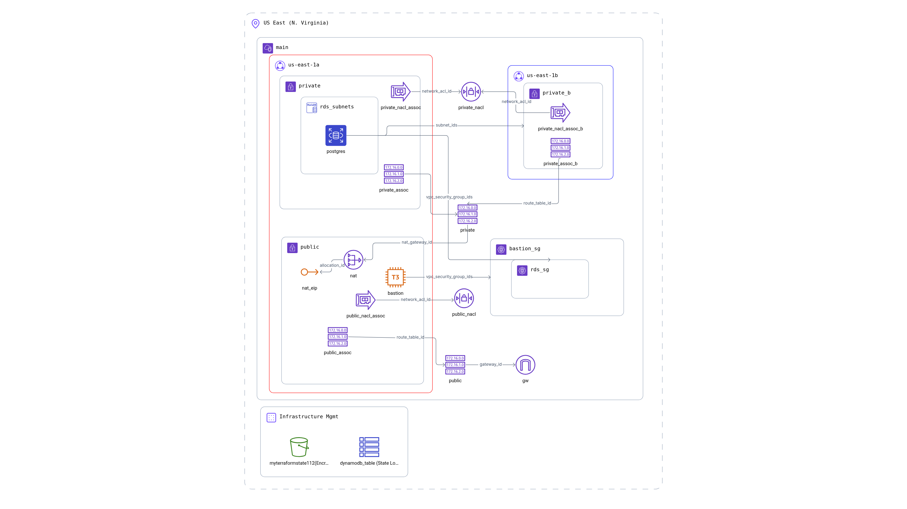

# Secure RDS Deployment with Terraform

## Overview

This project deploys a secure Amazon RDS (PostgreSQL) instance using Terraform with a Bastion host for secure access, following AWS best practices. The infrastructure includes a VPC with public and private subnets, security groups, and proper network isolation.

## Architecture



*Figure: AWS RDS Infrastructure with Bastion Host Architecture*

### Components

- **VPC**: Custom VPC with DNS support and hostnames
- **Public Subnet**: Hosts the Bastion instance with internet access
- **Private Subnets**: Host the RDS instance (multi-AZ for high availability)
- **Bastion Host**: EC2 instance for secure SSH access to private resources
- **RDS Instance**: PostgreSQL database in private subnet
- **Security Groups**: Restrictive access controls
- **NAT Gateway**: Provides internet access for private subnet resources

## Security Practices

### Network Security
- **Private RDS**: Database is not publicly accessible
- **Bastion Host**: Only entry point to private resources
- **Security Groups**: 
  - Bastion: SSH (port 22) access only from specified IP
  - RDS: PostgreSQL (port 5432) access only from Bastion security group
- **Network Isolation**: Clear separation between public and private subnets

### Access Control
- **IP Restriction**: SSH access limited to your specific IP address
- **Key-based Authentication**: EC2 instance uses SSH key pairs
- **Database Access**: Only accessible through Bastion host tunnel

### Data Protection
- **Encryption**: Terraform state stored encrypted in S3
- **No Hardcoded Secrets**: Sensitive values managed through variables
- **Skip Snapshot**: Configured for development (adjust for production)

## Prerequisites

1. **AWS CLI** configured with appropriate credentials
2. **Terraform** installed (version >= 1.0)
3. **SSH Key Pair** created in AWS EC2 console
4. **S3 Bucket** for Terraform state storage with versioning enabled

## Deployment Instructions

### 1. Clone and Navigate
```bash
git clone <repository-url>
cd IaC-Project
```

### 2. Configure Variables
Edit `terraform.tfvars` with your specific values:
```hcl
aws_region            = "us-east-1"
project_name          = "your-project-name"
allowed_ssh_ip        = "YOUR.IP.ADDRESS.HERE/32"  # Your public IP
bastion_ami           = "ami-0e2c86481225d3c51"    # Amazon Linux 2
bastion_instance_type = "t3.micro"
key_name              = "your-key-pair-name"       # Your EC2 key pair
db_username           = "admin"
db_password           = "your-secure-password"
s3_bucket_name        = "your-terraform-state-bucket"
```

### 3. Initialize Terraform
```bash
terraform init
```

### 4. Plan Deployment
```bash
terraform plan
```

### 5. Deploy Infrastructure
```bash
terraform apply
```
Type `yes` when prompted to confirm the deployment.

### 6. Get Outputs
```bash
terraform output
```

## Accessing the Database

### 1. Connect to Bastion Host
```bash
ssh -i /path/to/your-key.pem ec2-user@<bastion-public-ip>
```

### 2. Install PostgreSQL Client (on Bastion)
```bash
sudo yum update -y
sudo yum install postgresql15 -y
```

### 3. Connect to RDS
```bash
psql -h <rds-endpoint> -U <username> -d postgres
```

### Alternative: SSH Tunnel
Create an SSH tunnel from your local machine:
```bash
ssh -i /path/to/your-key.pem -L 5432:<rds-endpoint>:5432 ec2-user@<bastion-public-ip>
```

Then connect locally:
```bash
psql -h localhost -U <username> -d postgres
```

## File Structure

```
IaC-Project/
├── main.tf                 # Main Terraform configuration
├── variables.tf            # Variable definitions
├── terraform.tfvars        # Variable values (configure this)
├── outputs.tf              # Output definitions
├── modules/
│   ├── vpc/
│   │   ├── main.tf         # VPC, subnets, routing
│   │   ├── variables.tf    # VPC variables
│   │   └── outputs.tf      # VPC outputs
│   ├── bastion/
│   │   ├── main.tf         # Bastion host and security group
│   │   ├── variables.tf    # Bastion variables
│   │   └── outputs.tf      # Bastion outputs
│   └── rds/
│       ├── main.tf         # RDS instance and security group
│       ├── variables.tf    # RDS variables
│       └── outputs.tf      # RDS outputs
└── README.md               # This file
```

## Cost Optimization

- **Instance Types**: Using t3.micro for Bastion and db.t3.micro for RDS (free tier eligible)
- **Storage**: Minimal allocated storage (20GB)
- **No Multi-AZ**: Single AZ deployment for cost savings (adjust for production)

## Cleanup

To destroy all infrastructure:
```bash
terraform destroy
```

Type `yes` when prompted to confirm the destruction.

## Troubleshooting

### Common Issues

1. **SSH Connection Failed**
   - Verify security group allows your IP
   - Check key pair name is correct
   - Ensure instance is in running state

2. **Database Connection Failed**
   - Verify RDS instance is available
   - Check security group allows connection from Bastion
   - Confirm endpoint address is correct

3. **Terraform State Issues**
   - Ensure S3 bucket exists and is accessible
   - Verify AWS credentials have S3 permissions

### Validation Commands

```bash
# Check infrastructure status
terraform show

# Validate configuration
terraform validate

# Check outputs
terraform output

# AWS CLI verification
aws ec2 describe-instances --filters "Name=tag:Name,Values=*bastion*"
aws rds describe-db-instances --db-instance-identifier <project-name>-rds
```

## Production Considerations

For production deployments, consider:

- Enable RDS Multi-AZ deployment
- Configure automated backups
- Use AWS Secrets Manager for database credentials
- Implement monitoring and alerting
- Add additional security layers (WAF, CloudTrail)
- Use private subnets for Bastion host with VPN/Direct Connect

## Support

For issues or questions, please refer to the AWS documentation or Terraform documentation.
